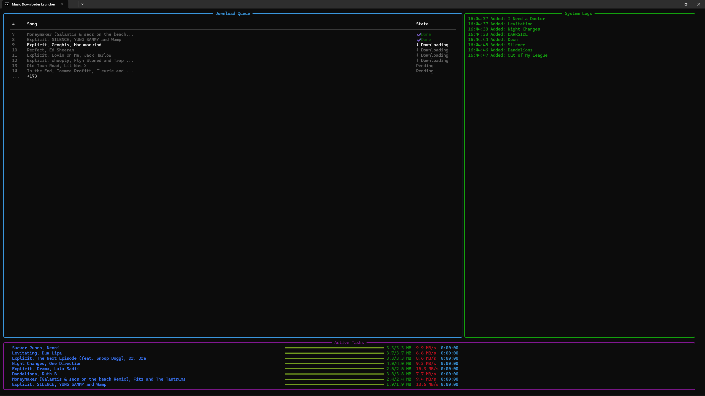

# 🎵 Music Downloader (Car-Optimized Edition)

A **robust, music downloader** built with Python, designed for **offline USB playback**, especially optimized for **car head units**.

This tool intelligently:

* Downloads high-quality MP3 audio
* Cleans messy titles and filenames
* Prevents duplicates (even semantic ones)
* Tags music correctly (Title / Artist / Album / Cover Art)
* Handles interruptions safely (Ctrl+C)
* Maintains a persistent song history (“Brain”)
* Works seamlessly with **Spotify playlists**, **Apple Music playlists**, and **direct search queries**

---

## 🚀 Key Features

### 🔐 Stability & Safety

* Graceful shutdown on **Ctrl+C**
* Forced kill protection
* Automatic temp file cleanup
* Retry mechanism for unstable downloads
* Session logging (`session.log`)

### 🧠 Smart Duplicate Detection

* Exact history matching
* Fuzzy similarity detection
* Token overlap safety (prevents false matches like *“Love” vs “Love Story”*)
* History pruning to keep performance fast

### 🚗 Car Head-Unit Optimized

* Filename length limits (64 chars)
* Illegal character removal
* UTF-8 safe filenames
* Compatible with strict infotainment systems

### 📦 Organized Library

* Category-based folders
* Clean filenames
* Auto metadata tagging via iTunes API
* Embedded album art

---

## 📁 Project Structure

```
Music/
├── main.py
├── setup.bat
├── requirements.txt
└── README.md
```

---

## ⚙️ Requirements

### Mandatory

* **Windows 10 / 11**
* **Python 3.9+**
* **Internet connection**

### Automatically Installed

* yt-dlp
* ffmpeg
* spotipy
* selenium
* rich
* mutagen
* webdriver-manager

---

## 🛠️ One-Click Setup (Recommended)

You already have a **fully automated installer**.

### ▶️ Steps

1. **Double-click**

   ```
   setup.bat
   ```

2. The script will:

   * Check Python
   * Create a virtual environment
   * Install all dependencies
   * Auto-install FFmpeg (via Winget)
   * Launch the downloader

⚠️ **Important:**
If FFmpeg installs for the first time, **restart the `.bat` file once**.

---

## 🔑 Spotify Setup (Optional but Recommended)

To enable Spotify playlist downloads:

1. Go to
   👉 [https://developer.spotify.com/dashboard](https://developer.spotify.com/dashboard)
2. Create an app
3. Copy:

   * Client ID
   * Client Secret
4. Paste them into `main.py`:

```python
SPOTIPY_CLIENT_ID = "YOUR_CLIENT_ID"
SPOTIPY_CLIENT_SECRET = "YOUR_CLIENT_SECRET"
```

---

## 🎮 How to Use

1. Launch via:

   ```
   setup.bat
   ```

2. Select a category:

   ```
   [1] Kannada - New
   [2] Hindi
   [3] English
   [4] Others
   ```

3. Paste one of the following:

   * Spotify playlist link
   * Apple Music playlist link
   * YouTube link
   * Song name (text search)

4. Sit back. The system will:

   * Skip duplicates
   * Retry failed downloads
   * Clean filenames
   * Tag music properly

---

## ⛔ Graceful Shutdown

* Press **Ctrl + C once** → finishes current task safely
* Press **Ctrl + C again** → force exit

No corrupted files. No broken MP3s.

---

## 🧾 Logs & History

### `session.log`

* Full execution log
* Useful for debugging and audits

### `song_history.json`

* Persistent memory of downloaded songs
* Prevents re-downloads across sessions
* Auto-pruned to last **5000 songs**

---

## 🧩 Customization Guide

### ✏️ Change / Add Categories (Very Easy)

Categories are **fully user-editable**. You do **not** need to change logic — only folder names.

Open **`main.py`** and edit the `FOLDERS` dictionary:

```python
FOLDERS = {
    "1": ("Kannada - New", "Kannada New"),
    "2": ("Hindi", "Hindi Bollywood"),
    "3": ("English", "English Pop"),
    "4": ("Others", "South Indian Mix"),
}
```

#### How it works:

* **First value** → Folder name created on disk
* **Second value** → Genre tag written into MP3 metadata

#### Examples:

✅ Rename a category:

```python
"2": ("Hindi Classics", "Hindi Old")
```

✅ Add a new language:

```python
"5": ("Tamil", "Tamil Songs")
```

⚠️ **Important rules:**

* Keep the number keys unique (`"1"`, `"2"`, etc.)
* Avoid special characters in folder names
* Restart the program after editing

No other code changes are required.

### Change Folder Names

Edit:

```python
FOLDERS = {
    "1": ("Kannada - New", "Kannada New"),
    "2": ("Hindi", "Hindi Bollywood"),
    ...
}
```

### Increase Parallel Downloads

```python
MAX_WORKERS = 4
```

⚠️ Increase cautiously — YouTube throttles aggressively.

### Change Filename Length Limit

```python
MAX_FILENAME_LEN = 64
```

---

## ⚠️ Known Limitations

* Apple Music scraping depends on Apple’s page structure
* Requires Chrome for Selenium
* Not intended for DRM-protected content

---

## 🏁 Best Use Case

✔ Personal offline music collection
✔ USB playback in cars
✔ Clean, organized MP3 libraries
✔ Long-term daily usage without re-downloads

❌ Streaming
❌ Commercial redistribution


---


### Happy listening. 🚗🎶


## 📸 Preview

> Live terminal UI with per-song progress bars, system logs, and queue management.

